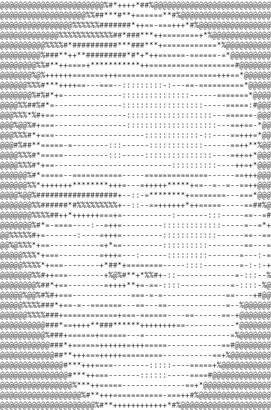

<picture align="left">
    <source width=50% align="left" media="(prefers-color-scheme: dark)" src="ASCII-art-dark.png">
    
</picture>

```
joshua kranabetter
-------------------------
OS: Windows / Linux
Pronouns: He/Him
Location: British Columbia, Canada
Languages: Python, C/C++, Javascript, Java
Interests: Machine Learning, Software Developement
Learning: Rust, .Net
Hobbies: Gardening, Rock Climbing, Chess
Discord: FishingEnjoyer#1293
```